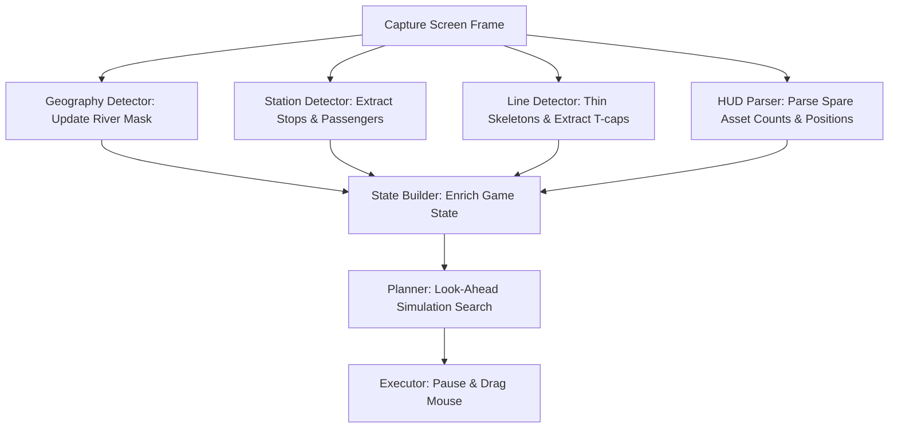

# Mini Metro AI 🚇🤖

An autonomous, highly strategic AI agent that plays the minimalist subway-building simulator **Mini Metro** entirely through computer vision and simulated mouse/keyboard inputs. 

The agent runs locally, continually captures screen frames, translates visual elements into a live graph model, dynamically simulates potential extension routes, and executes precise real-time actions to grow an optimal transit network.

---

## 🚇 About the Game: Mini Metro
**Mini Metro** is a sublime, minimalist puzzle game where you design a subway layout for a rapidly expanding city. Stations are represented by shapes (circles, triangles, squares), and passengers appear at these stations waiting to travel to a matching destination shape. You must draw colored subway lines between stations to connect them. As the population grows, stations become congested; if any station remains overcrowded for too long, the city shuts down and it's Game Over.

---

## 🧠 How the AI Thinks (Perceive-Think-Act Pipeline)

The agent operates on a continuous loop at a target rate of 10 FPS:



### 1. Computer Vision & Perception
- **Adaptive Station Detection (`vision/station_detector.py`)**: Uses multi-pass edge contours to locate station shapes and calculate passenger queue sizes. It implements **high-precision localized exclusions** (Bottom-Center `y > 76%` at center, Bottom-Left and Bottom-Right `y > 78%` at corners) to ignore bottom color palettes, spare assets, and active locked track placeholders, while successfully detecting and connecting stations spawning on the extreme bottom margins.
- **Path Skeletonization (`vision/line_detector.py`)**: Identifies colored transit paths by running customized HSV masks. It skeletonizes thick line blocks into 1-pixel-wide center paths.
- **T-Cap Endpoint Locator (`vision/line_end_detector.py`)**: Convolves a neighborhood-counting filter over thinned skeletons to find the line's true geometric ends (T-caps). Extensions are strictly dragged from these T-caps to prevent invalid branches.
- **River Mask Extraction (`vision/geography_detector.py`)**: Dynamically extracts geographical rivers from Day, Night, or City themes using color-quantized median clustering. Checks if any line segment crosses the water.
- **HUD Asset & Milestone Parser (`vision/hud_parser.py`)**: Matches templates at multiple scales to read spare Trains, Carriages, and Tunnels in the bottom-right corner. It uses contour circularity filtering ($>0.80$) to detect milestone selections with 100% immunity to dark themes or paused overlays.
- **Milestone Option Classifier (`agent.py`)**: When the weekly milestone selection popup is triggered, the agent crops both option circles and feeds them into a multi-stage visual classifier:
  - **Color/Saturation**: Flags the option as a `"line"` if it contains highly-saturated colored pixels (vivid line color badge).
  - **Multi-Scale Template Matching**: Compares inner gray details against pre-loaded `train_icon.png` and `carriage_icon.png` to identify **Trains** and **Carriages**.
  - **Contour/Shape Analysis**: Differentiates **Tunnels** (split horizontal parallel shapes or aspect ratio $> 2.0$) and **Interchanges** (complex star contours with low solidity and aspect ratio close to 1.0).

### 2. The Look-Ahead Simulation Planner (`engine/planner.py`)
Rather than relying on hardcoded static heuristics, the agent **dynamically simulates** the network topology before taking any move:
- **Action Simulation**: Clones the current `GameState` and applies candidate connections (adding lines, extending endpoints, or deploying assets).
- **Multi-Objective Value Function**: Scores each simulated outcome $V(s')$ based on:
  - **Shape Alternation**: Substantially rewards lines that alternate shapes (e.g. Circle -> Triangle -> Square) and heavily penalizes runs of identical shapes (e.g. Circle -> Circle), matching professional human layouts.
  - **Congestion Spikes**: Quadratically penalizes high queues to prevent individual station bottlenecks.
  - **Tunnel Efficiency**: Enforces that river crossings do not exceed spare tunnel resources, and applies a minor penalty for using water tunnels.
- **State-Aware Milestone Selector**: Interrogates the latest network topology (`num_lines`, `spare_tunnels`) to make strategic upgrade choices. It prioritizes: **Tunnel (if `spare_tunnels == 0`) > Train > Carriage/Interchange > Line**. In the mid-to-late game (lines $\ge 4$), choosing a new Line is heavily penalized (priority 0) to avoid the "Diluted Line Bottleneck" (too many lines with only 1 train each).
- **Optimal Choice**: Executes the candidate connection that produces the highest simulated score.

### 3. Execution & Vector Overshooting (`executor.py` & `engine/pause_manager.py`)
To ensure game stability, the agent uses a **Pause-Cycle workflow**:
- Throttles mouse events to prevent spamming.
- Pauses the game (`Spacebar`), confirms the pause status visually, executes the look-ahead planned mouse drag-and-drop operations, and then unpauses to let passengers flow.
- **Snappy Over-Drag Vectoring**: Upgraded drag actions calculate the exact drag vector and apply a strategic **20-pixel overshoot** past the target station center. This pulls the mouse cursor cleanly through the game's snapping connection window, securing a 100% line routing success rate and eliminating missed snaps.


---

## ⚙️ Setup & Installation

### Prerequisites
- Windows OS (uses Windows APIs for low-latency capture)
- Python 3.9+
- A copy of Mini Metro running in windowed mode at **1920x1080 resolution**.

### Installation
1. Clone the repository:
   ```bash
   git clone https://github.com/Anishp-cell/Mini_Metro_AI.git
   cd Mini_Metro_AI
   ```
2. Install dependencies:
   ```bash
   pip install -r requirements.txt
   ```

---

## 🚀 Usage

Launch Mini Metro, set the resolution to 1920x1080, and run the agent:

```bash
python agent.py
```

### CLI Options
- `python agent.py --debug`: Saves annotated computer vision visual dumps in `logs/debug/` so you can see the skeletons, contours, and templates the AI is processing.
- `python agent.py --dry-run`: Runs full capture, vision, and look-ahead planning, but does **not** simulate mouse/keyboard inputs. Great for testing vision accuracy.

### Emergency Kill Switch
- Move your mouse cursor rapidly into any of the **four corners of your screen**. This instantly triggers the PyAutoGUI fail-safe and aborts the agent.
- You can also press `Q` in the console window.
